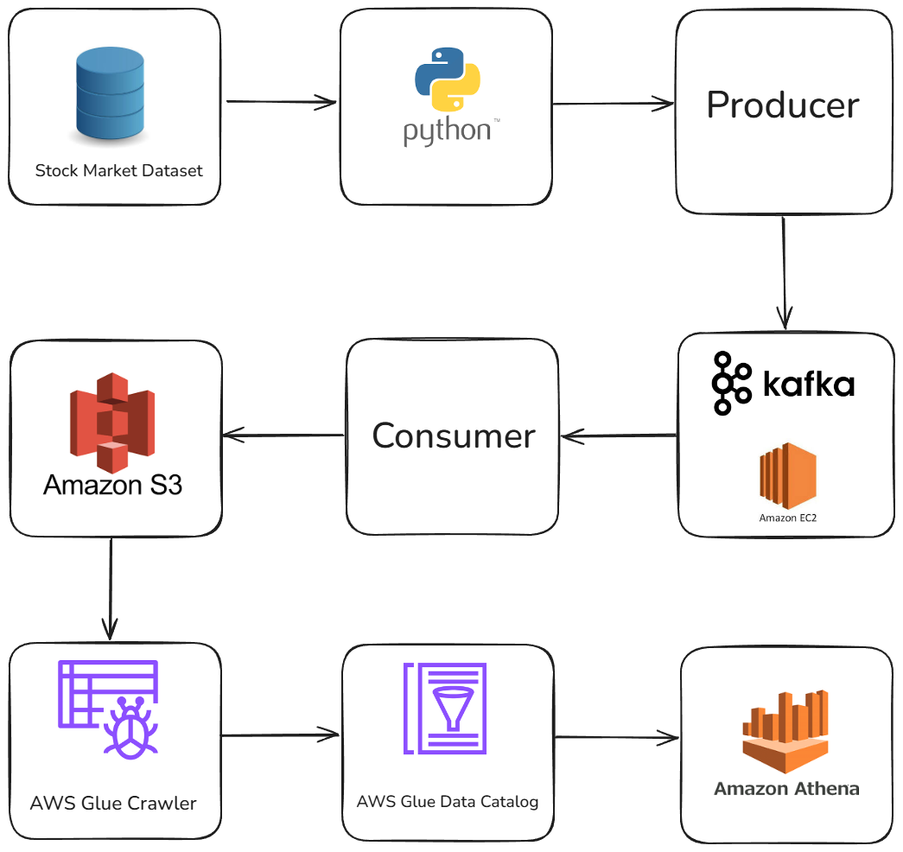

# Stock-Market-Real-Time-Data-Engineering-Project-Using-Kafka
An **end-to-end data engineering project** that simulates real-time stock market data streaming, ingestion, processing, and analysis using **Apache Kafka** and related technologies.
## Architecture

## Overview  
- **Tutorial-based:** Adapted from a YouTube tutorial on end-to-end data engineering with Kafka and Python.  
- **Pipeline Highlights:**  
  - Real-time stock price generation (Python producer)  
  - Streaming ingestion into Kafka topics  
  - Consumer processing and transformation of events  
  - Storage into the AWS S3
  - Process using AWS Glue and Glue Data Catalog
  - Analyze stock trends in real time  
- **Tech Stack:**  
  - **Apache Kafka** for streaming & messaging  
  - **Python** for producer/consumer scripts  
  - **AWS S3/Glue/Glue Data Catalog** for storage and process  
  - **Pandas/AWS Athena** for analysis 
  - **Git/GitHub** for version control and documentation  
## Outcomes  

- **Simulated real-time stock feed** with a Python producer  
- **Streamed messages** into Kafka topics for scalable ingestion  
- **Processed and transformed data** using Python consumers  
- **Persisted data** into AWS S3 for downstream analytics
- **Processed data** using AWS Glue and AWS Glue Data Catalog
- **Analyzed stock trends** with Pandas and AWS Athena  
- **Followed modular project structure** and best practices for data engineering

Inspired by Darshil Parmar
